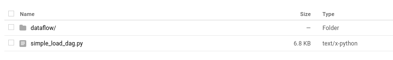

# Serverless Data Warehousing Solution With Cloud Functions And Bigquery On GCP

## Introduction

Traditionally

Next Apache Airflow

Apache Airflow :

Cloud Composer : A fully managed workflow orchestration service built on Apache Airflow.

A better way for some use cases

### TODO : Comparison Table

## With Cloud Composer (Manage Apache Airflow)

It is recommended that virtualenv be used to keep everything tidy in the local environmeny. The [requirements.txt](requirements.txt) describes the dependencies needed for the code used in this repo.

The following high-level steps describe the setup needed to run this example:

1. Create a Cloud Storage (GCS) bucket for receiving input files (*input-gcs-bucket*), for storing processed files (*output-gcs-bucket*) and storing temporary files (*temp-gcs-bucket*).

2. Create a Cloud Composer environment from your terminal or Cloud Shell

```Shell
gcloud composer environments create example-environment --location=asia-south1
```

It takes some time to create. Make sure you have the right quota limit of CPUs.

4. Create a Cloud BigQuery table from the console for the processed output. The following schema is used for this example:

|Column Name|Column Type|
|:-|:-|
|state|STRING|
|gender|STRING|
|year|STRING|
|name|STRING|
|number|STRING|
|created_date|STRING|
|filename|STRING|
|load_dt|DATE|

5. Set the following [Airflow variables](https://airflow.apache.org/docs/stable/concepts.html#variables) needed for this example:

| Key                   | Value                                           |Example                                   |
| :--------------------- |:---------------------------------------------- |:---------------------------              |
| gcp_project           | *your-gcp-project-id*                           |cloud-comp-df-demo                        |
| gcp_temp_location     | *gcs-bucket-for-dataflow-temp-files*            |gs://my-comp-df-demo-temp/tmp             |
| gcs_completion_bucket | *output-gcs-bucket*                             |my-comp-df-demp-output                    |
| input_field_names     | *comma-separated-field-names-for-delimited-file*|state,gender,year,name,number,created_date|
| bq_output_table       | *bigquery-output-table*                         |my_dataset.usa_names                      |
| email                 | *some-email@mycompany.com*                      |some-email@mycompany.com                  |

 The variables can be set from the terminal as follows as follows:

 `gcloud composer environments run` **_cloud-composer-env-name_** `variables -- --set` **_key val_**

 Example :

 ```Shell
gcloud composer environments run project-name --location asia-northeast1 variables -- --set email johndoe@example.com
 ```

From the Airflow GUI, you can create them in Admin -> Variables

6. Browse to the Cloud Composer widget in Cloud Console and click on the DAG folder icon as shown below:


7. The DAG folder is essentially a Cloud Storage bucket. Upload the [simple_load_dag.py](simple_load_dag.py) file into the folder:


8. Upload the Python Dataflow code [process_delimited.py](dataflow/process_delimited.py) into a *dataflow* folder created in the base DAG folder.

9. Finally follow these instructions to create a Cloud Function :
    - To authenticate to IAP, grant the Appspot Service Account (used by Cloud Functions) the Service Account Token Creator role on itself

```Shell
gcloud iam service-accounts add-iam-policy-binding \
your-project-id@appspot.gserviceaccount.com \
--member=serviceAccount:your-project-id@appspot.gserviceaccount.com \
--role=roles/iam.serviceAccountTokenCreator
```

- Get the client ID by running the `get_client_id.py` which can be found [here](https://github.com/GoogleCloudPlatform/python-docs-samples/blob/master/composer/rest/get_client_id.py)

```Shell
python3 get_client_id.py <your-project-id> <your-composer-location> <your-composer-environment>
```

- Ensure that the **DAG_NAME** property is set to _**GcsToBigQueryTriggered**_ i.e. The DAG name defined in [simple_load_dag.py](simple_load_dag.py)

***

### Triggering The Workflow

The workflow is automatically triggered by Cloud Function that gets invoked when a new file is uploaded into the *input-gcs-bucket*
For this example workflow, the [usa_names.csv](resources/usa_names.csv) file can be uploaded into the  *input-gcs-bucket*

```Shell
gsutil cp resources/usa_names.csv gs:// _input-gcs-bucket_
```

***

## With Cloud Functions

```Shell
gcloud functions deploy gcs-to-bq --region=asia-south1 --entry-point=gcs_to_bq --runtime=python37 --trigger-bucket=input-bucket --source=functions/gcs-to-bq/
```

## References

- [Cloud Composer Example](https://github.com/GoogleCloudPlatform/professional-services/tree/master/examples/cloud-composer-examples)
- [GCS Bucket To Bigquery Cloud Function](https://github.com/omar16100/gcs-to-bigquery-function)
- [Google Sheets To Bigquery Cloud Function](https://github.com/omar16100/sheets-to-bigquery-cloud-function)
- [GCS Triggered Cloud Functions](https://zaxrosenberg.com/gcs-triggered-google-cloud-functions/)

## Debugging Notes

- Make sure you are in the right location supported by Cloud Composer
- The number of CPU quota should be satisfied
